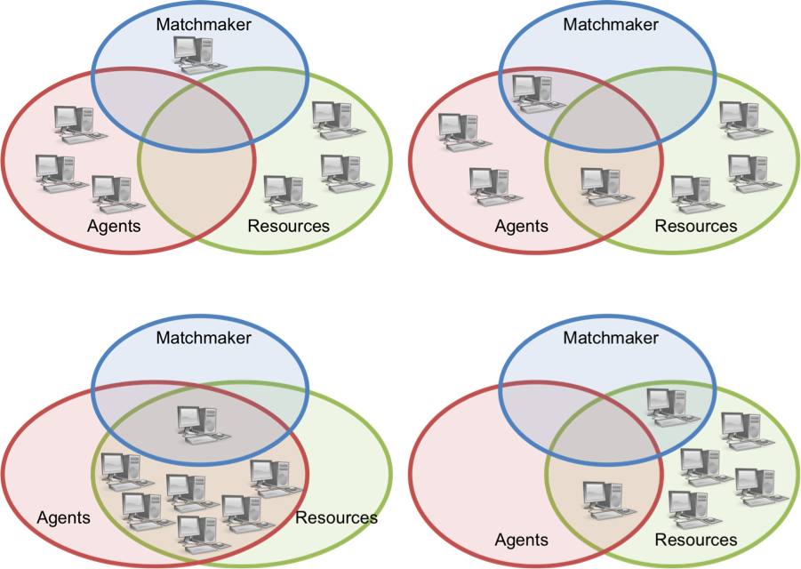

********************
Overview of HTCondor
********************
This is designed to be a basic, high-level overview of some of the key features and functionality of HTCondor. For a complete reference for HTCondor see the `HTCondor User Manual <http://research.cs.wisc.edu/htcondor/manual/>`_.

.. warning::

    I am not an expert in HTCondor. I've worked with HTCondor for the last several years and have realized that there is a steep learning curve. This overview is designed to give a brief introduction to some of the main concepts of HTCondor as I understand them, for those that want to use HTCondor, but are not experts in the field of scientific computing.

What is HTCondor
================
HTCondor is a job scheduling and resource management software. HTCondor creates an HTC system by grouping, or “pooling”, network-connected computing resources. A common example of an HTCondor pool is a set of lab or office computers that are all on the same network and configured (through HTCondor) to be part of the same computing system. Each computer in the pool is assigned one or more roles such as matchmaker, resource, or agent. Background processes, called daemons, which are specified in the computer’s HTCondor configuration file determine the role(s) of a computer. Each pool has only one matchmaker, which serves as the central manager. All other computers in the pool are resources and/or agents and are configured to report to the central manager. A resource is also known as a worker, and is a computer designated to run jobs. And an agent, also known as a scheduler, is a computer designated to schedule jobs. Any computer in the pool (including the central manager) may function as both a resource and an agent. Figure 1 shows a possible HTCondor pool configuration.

**Figure 1.** Possible HTCondor pool configurations.

To submit a job to the pool a user must create a file to describe the job requirements, including the executable and any input or output files. This file is known as a problem solver. The user submits the problem solver to an agent, which advertises the requirements needed to run the job to the central manager. Similarly, each resource in the pool also advertises its availability, capabilities, and preferences to the central manager. This advertising, from both the agents and the resources, is done using a schema-free language called ClassAds. Periodically the central manager scans the ClassAds from resources and from agents and try to match jobs and resources that are compatible. When a match is made, the central manager notifies the agent and the resource of the match. It is then the agent’s responsibility to contact the resource and start the job. This interaction is handled by a process running on the agent, known as the shadow, which communicates with a process running on the resource, called the sandbox. The shadow provides all of the details required to execute a job, while the sandbox is responsible for creating a safe and isolated execution environment for the job.

Universes
=========
HTCondor provides several runtime environments called universes. The two most common universes are the standard universe and the vanilla universe. The standard universe is only available on Unix machines. It enables remote system calls so the resource that is running the job can remotely make calls to the agent to open and read files, which means that job files need not be transferred, but can remain on the submitting machine. It also provides a mechanism called checkpointing. Checkpointing enables a job to save its state. Thus when a resource becomes unavailable in the middle of executing a job (because, for example, a user starts using the computer where the job is running), the job can start on a new resource from the most recent checkpoint. The vanilla universe is the default universe and is the most generic. It requires that the computing resources have a shared file system or that files be transferred from the submitting machine to the computing resource. The vanilla universe does not provide the checkpointing mechanism, and thus, if a job is interrupted mid-execution, it must be restarted on a new resource. Various other universes are available and are described in greater detail in the user manual

Checkpointing
=============

Flocking
========
HTCondor also provides a mechanism, called flocking, for submitting jobs to more than one pool of resources. Flocking enables organizations to combine resources while maintaining control of their own pool. For a machine to be able to flock to a remote pool the remote scheduler must be identified in the configuration on that machine. Additionally, the remote scheduler must accept the machine to be flocked from in its own configuration. The submitting machine will first try to match jobs in its native pool, but when resources are not available then it will “flock” jobs to the remote pool. Generally, a remote pool will not have a shared file system, so jobs that are flocked must enable the file transfer mechanism.

DAGMan
======
HTCondor is ideal for embarrassingly parallel batch jobs, but it also provides a way of executing workflows using directional acyclic graphs (DAGs). A DAG specifies a series of jobs, referred to as nodes, that need to be run in a particular order and also defines the relationships between nodes using parent-child notation. This allows for the common situation where the output from a preliminary set of simulations is used as input for a subsequent set of simulations. An alternative scheduler called a DAG Manager (DAGMan) is used to orchestrate submitting jobs in the proper order to the normal scheduler. If a node in the DAG fails, the DAGMan generates a rescue DAG that keeps track of which nodes are completed and those that still need to run. A rescue DAG can be resubmitted, and it will continue the workflow from where it left off. This provides a robust mechanism for executing large workflows or a large number of jobs.

ClassAds
========

HPC vs. HTC
===========

Under the Hood
==============
